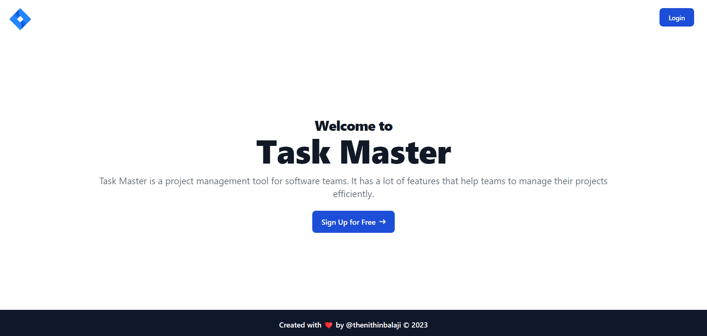
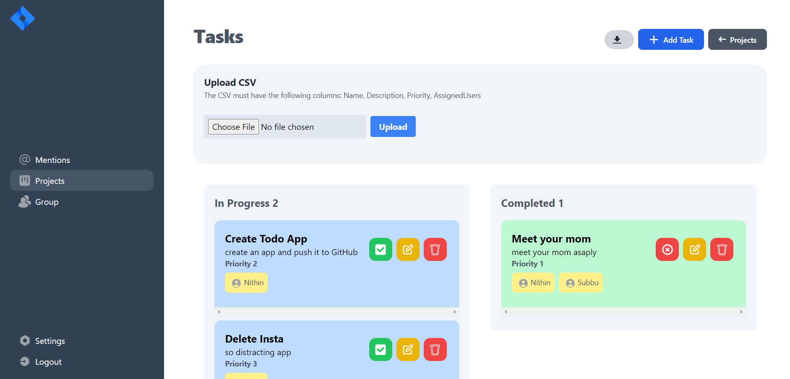
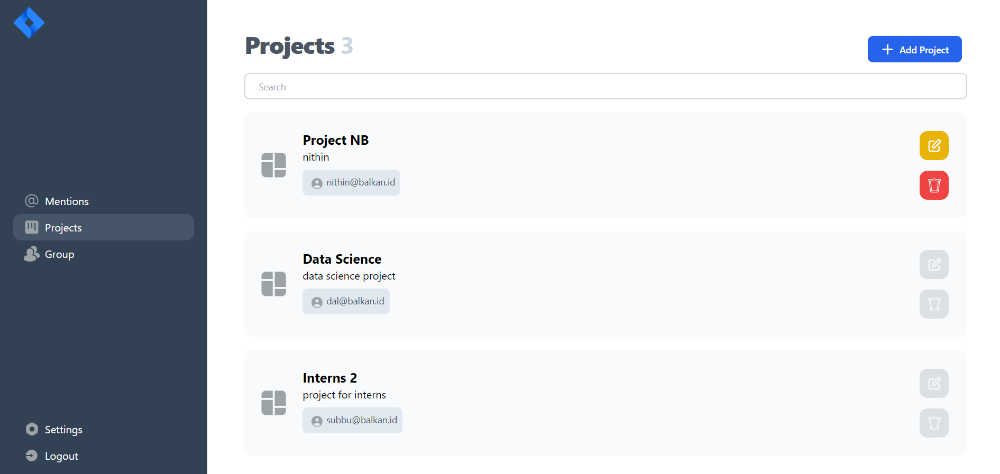
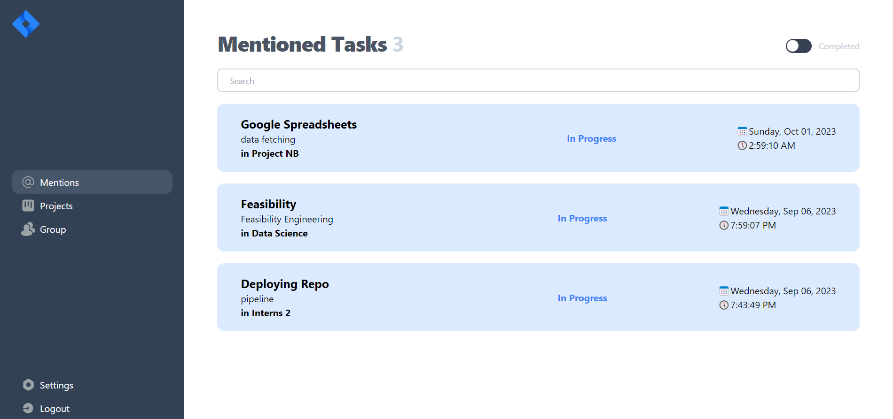

# Task Master

<p align="center">
  
</p>

TaskMaster is a powerful and user-friendly to-do list app designed to help you stay organized, boost productivity, and manage your tasks efficiently. Whether you're a busy professional, a student with a hectic schedule, or anyone looking to streamline their daily activities, TaskMaster has you covered. **TaskMaster, your tasks, mastered!** Built with React and Go.

<p align="center">
  <a href="#">
    
  </a>
</p>

# Running Instructions

- You need node.js ([https://nodejs.org/en/download](https://nodejs.org/en/download)), Postgres ([https://www.postgresql.org/download/](https://www.postgresql.org/download/)) and GO ([https://go.dev/doc/install](https://go.dev/doc/install)) installed in your system.

<p align="center">
  
</p>

- Create `.env` file inside backend folder.
  
```env
PORT = 8080
GIN_MODE = "release"

# postgres connection
DB_HOST = ""
DB_PORT = 
DB_NAME = ""
DB_USER = ""
DB_PASSWORD = ""

JWT_SECRET = "" # can be anything
```

- In the project directory run:

```bash
npm run start
```

Open [http://localhost:3000](http://localhost:3000) to view it in your browser.

<p align="center">
  
</p>

- Alternatively refer to [backend/README.md](backend/README.md) and [frontend/README.md](frontend/README.md) for the running frontend or backend separately.
- Frontend runs in Port 3000
- Backend runs in Port 8080
- Make sure no other process is using these ports.

<p align="center">
  
</p>
